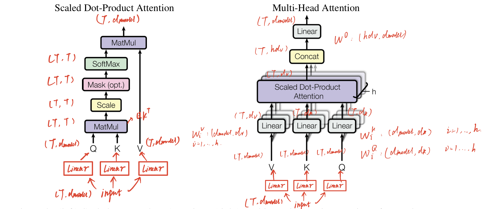

# NLP models from scratch 

## Task 1: 
A minimal example to implement Transformers. 

## TODOs: 
- [] Bert from scratch 
- [] Fine-tuning 
- [] inspect neurons
- [] 

# References: 
  - [The Annotated Transformer](http://nlp.seas.harvard.edu/annotated-transformer/)